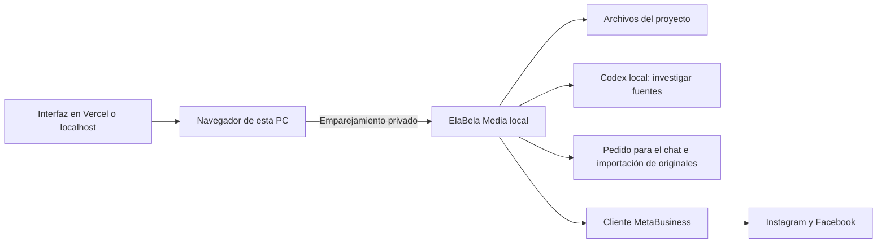

# Servicio local y conexión con la página

El programa local hace de puente entre la interfaz y los archivos de esta PC. La página muestra las ideas, recibe tus elecciones y pide operaciones al programa. Este inicia Codex para investigar, conserva referencias y originales, prepara pedidos para generar en este chat e importa sus imágenes, y llama al cliente Meta que ya existe.

El acceso es loopback, sin puerto público, túnel o regla de firewall. El iniciador abre una pestaña con una credencial en el fragmento de URL; la aplicación la guarda solo en la sesión de esa pestaña y quita el fragmento. No compartas ese enlace ni `.local/connection.json`. La credencial de sesión es local y persistente en disco, no un código de un solo uso. Para invalidarla: detené el servicio, conservá una copia privada de ese archivo fuera de circulación, quitá únicamente `connection.json` y reiniciá. No borres `state.json` ni checkpoints.

## Inicio y cierre

La URL local directa `http://127.0.0.1:4317/` también conecta automáticamente una pestaña nueva. Solo la página del mismo origen local puede obtener esa sesión; Vercel conserva el enlace del iniciador. **Conectar** reintenta y muestra errores dentro del diálogo, con un tiempo de espera limitado. **Conexión manual** es opcional para la página local y sus campos cerrados no bloquean el botón.

`Iniciar ElaBela Media.cmd` compila y arranca Node oculto, o reutiliza el servicio que responde con la credencial de este proyecto. Guarda PID y hora de inicio. `Detener ElaBela Media.cmd` pide un cierre autenticado: primero bloquea nuevas operaciones y luego espera los trabajos activos antes de cerrar. No mata una publicación a mitad del envío. Después de un corte abrupto, los trabajos inconclusos aparecen interrumpidos y las publicaciones inciertas quedan bloqueadas hasta conciliación.

Un bloqueo local impide iniciar otra instancia que sobrescriba el estado de trabajos del proceso activo. Después de actualizar código/configuración, detené y volvé a iniciar. El servicio requiere la cuenta Windows que puede descifrar el token DPAPI existente. No se registra inicio automático del sistema.

## Vercel

El frontend se despliega como Vite estático. `ELABELA_WEB_URL` admite solo un origen HTTPS exacto. El iniciador lo agrega a los orígenes permitidos de esta PC y abre la web emparejada. Para varias direcciones, usá **Mi espacio → Direcciones permitidas** desde localhost. No se admiten comodines.

[Chrome documenta el permiso de acceso a red local](https://developer.chrome.com/blog/local-network-access). Su comportamiento debe probarse en el dominio desplegado; esa prueba no se reemplaza por el health del servidor. Si el navegador no permite conectar, abrí la aplicación local. Desde otra PC/teléfono, localhost se refiere a ese otro dispositivo.

[La guía oficial de Vercel admite proyectos Vite](https://vercel.com/docs/frameworks/frontend/vite). Este proyecto no ejecuta PowerShell ni almacena campañas en funciones de Vercel.

## Si una operación falla

- Sin servicio: iniciar; no hay generación ni publicación mientras esté desconectado.
- Codex no disponible: abrir Codex e iniciar sesión; comprobar límites de la cuenta e Internet. Si el ejecutable no está en PATH, configurar `ELABELA_CODEX_PATH` y reiniciar. La investigación del botón utiliza Codex y puede demorar algunos minutos.
- Sin clave de OpenAI: el flujo predeterminado funciona con Codex. Prepará el pedido en la página, pegalo en este chat y después importá los originales; no necesitás una API paga de generación.
- Imagen rechazada: revisar bytes, orientación, PNG/JPEG/WebP, máximo 20 MB y proporción exacta 4:5. No ampliar una miniatura para llamarla master.
- Generación parcial: las piezas terminadas se conservan. Revisar proveedor y generar las faltantes manualmente; no hay retry ciego.
- Meta incierto/parcial: **Consultar estado en Meta** o `npm run reconcile -- ID_CAMPAÑA`. Son consultas de recuperación, no un botón para reenviar. Si la evidencia no alcanza, permanece pendiente y requiere revisión del registro/plataforma.

Los mensajes del navegador no incluyen tokens. Los estados y carpetas privados no deben publicarse como diagnóstico en GitHub.
